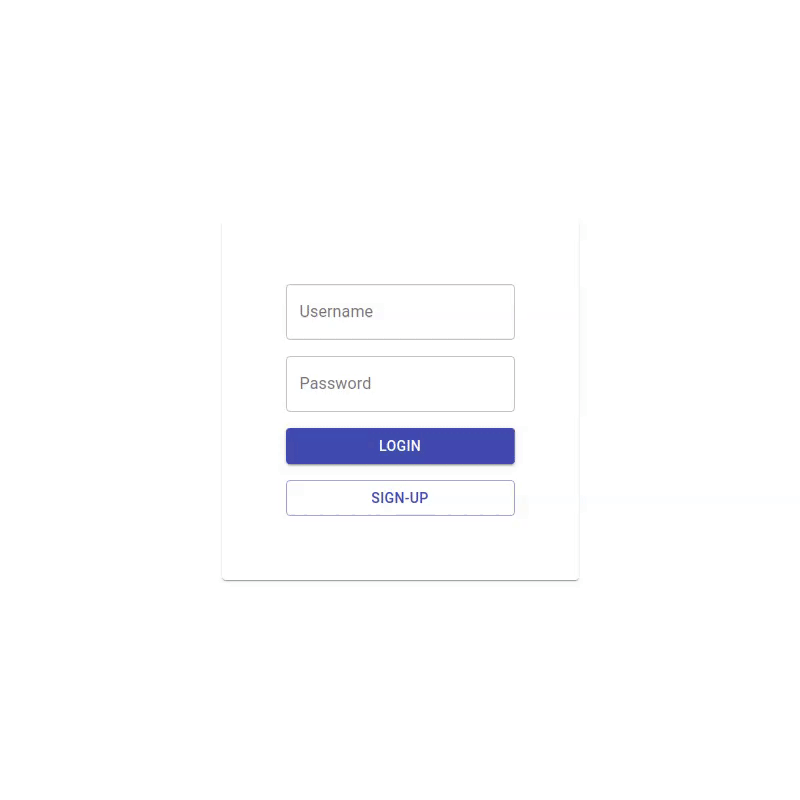
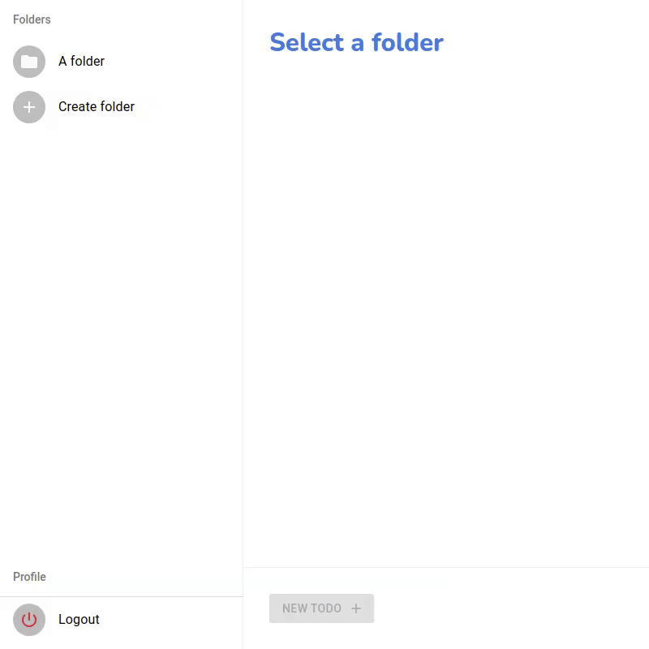
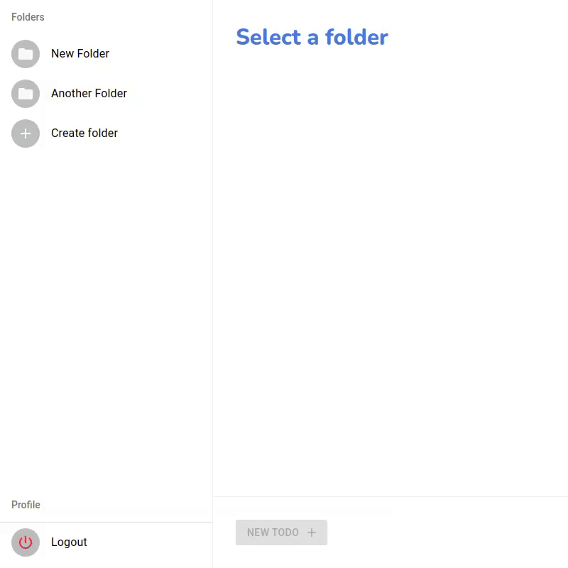

# Todos: React, GraphQL and Elixir

## Project description

This is my attempt at following [Make Programming Fun Again's](https://www.youtube.com/channel/UCW_YiVuoo-WG0bxQElVgxAg) video series on implementing a React+GraphQL+Elixir Todo Web App. The playlist com be found [here](https://www.youtube.com/watch?v=8MCmTiB3g6c&list=PLbYBXKy2Fbj8E3Zfo0_uVGVmMWNQxh5H3).

I'll follow each episode, while making minimal changes to the implementation. After completing the series, I'll add functionalities using the design patterns I'm used to.

## Todo

- [x] [API setup and data structures](https://www.youtube.com/watch?v=8MCmTiB3g6c)
- [x] [Set up React and Sass](https://www.youtube.com/watch?v=MxGQrmqubsI)
- [x] [Apollo, stealing design from Apple](https://www.youtube.com/watch?v=zObab-8qqQE)
- [x] [Toggling and updating](https://www.youtube.com/watch?v=Z7r-q8vntvQ)
- [x] [Deleting todo items, disappearing things](https://www.youtube.com/watch?v=saw_n_YTbR0)
- [x] [Creating new records](https://www.youtube.com/watch?v=SzBuz3lKNF8)

## Extras

- [x] Improve UX for creating and deleting items.
- [ ] ~~Syncing todos between multiple machines, using subscriptions~~. (Current libs for subscriptions using Phoenix Channels don't support Apollo Client 3.0+. Will find a work around later.)
- [x] Folders for grouping todos.
- [x] Simple user registration and authentication.
- [ ] Shareable links for viewing folders.
- [ ] OTP release.
- [ ] Deploy scripts for cloud hosting at GCP.

## Author

- Victor Gaíva

# Demo

## Sign-up and Login

## Folders

## Items

